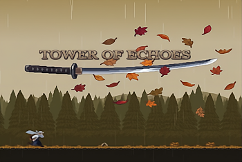
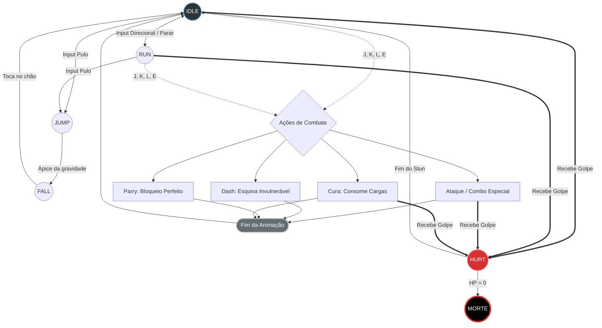
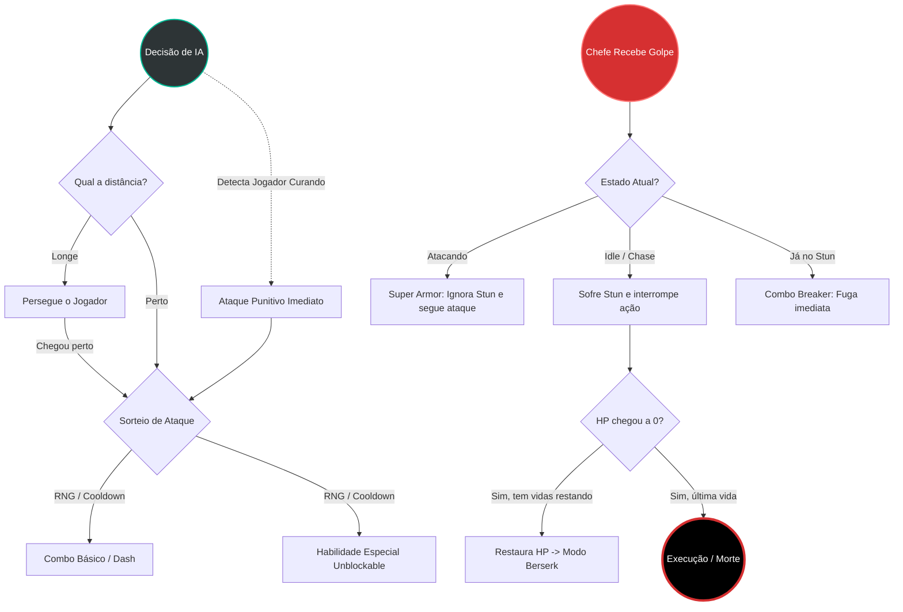

<h1 align="center">🗡️ Sombra e Eco (Tower of Echoes)</h1>

<p align="center">
  
</p>

> Um jogo de plataforma 2D focado em combates intensos contra chefes (*Boss Rush*), exigindo reflexos rápidos para *parry* e gestão de estamina. Desenvolvido durante uma Game Jam.

<p align="center">
  
  
  
</p>

🎮 **[Jogue no navegador via itch.io](https://yorguts.itch.io/tower-of-echoes)** 🎬 **[Assista ao Trailer de Gameplay](https://www.youtube.com/shorts/zkL-cjqfOf8)**

## 📋 Sobre o Projeto

Este projeto foi a nossa submissão para a **PET Game Jam da UFES**, conquistando o 2º lugar. O objetivo principal foi criar uma experiência punitiva e justa, onde o jogador precisa decorar padrões e agir no tempo exato.

Como o tempo de desenvolvimento era restrito, a equipe optou por focar 100% no polimento das hitboxes, colisões e na inteligência dos chefes. Devido a isso, o jogo acabou sendo deixado sem efeitos sonoros, a recomendação é jogar escutando a sua própria *playlist*.

### 👥 Equipe de Desenvolvimento
Projeto construído pelo trio:
* **[Gustavo](https://github.com/gustsoprani)**
* **[Tárcio](https://github.com/tarciofernandes14)**
* **[Marcos](https://github.com/MarcosBrunetti)**

---

## ⚙️ Destaques Técnicos e Lógica

O código-fonte foi estruturado utilizando módulos ES6 e empacotado com Vite para otimização web. O projeto brilha na sua arquitetura de combate, baseada fortemente em Máquinas de Estados Finito (FSM) e reatividade de Inteligência Artificial.

### 🤺 1. Máquina de Estados do Jogador (Player FSM)
O jogador possui um controlador de estado rígido que previne o cancelamento indevido de animações e *race conditions*. A mobilidade fluida é garantida por transições matemáticas de velocidade e detecção de solo (Grounded).



### 🧠 2. Inteligência Artificial dos Chefes (Boss Mechanics)
Os chefes (como Akane e Mestre Jubei) compartilham um núcleo de IA agressivo, desenhado para punir erros de posicionamento e evitar que o jogador vença apenas "esmagando botões" (*Anti-Stunlock*).



---

## 🚀 Repositório e Execução Local

**⚠️ AVISO DE LICENCIAMENTO:** *Os assets visuais (spritesheets, tilesets e backgrounds) utilizados na versão final possuem licenças pagas de uso restrito. Por questões de direitos autorais, a pasta `public/assets` **não está inclusa** neste repositório público. O código-fonte está preservado aqui exclusivamente para fins de estudo de arquitetura, lógica e portfólio.*

Se o projeto for clonado e executado localmente, o terminal funcionará perfeitamente, **mas o jogo renderizará uma tela preta** devido à ausência das imagens originais. 

Para inspecionar a estrutura do bundler e a lógica:

1. Clone o repositório:
   ```bash
   git clone [https://github.com/gustsoprani/towerofechoes.git](https://github.com/gustsoprani/towerofechoes.git)
   ```
2. Instale as dependências (Phaser e Vite):
   ```bash
   npm install
   ```
3. Inicie o servidor local:
   ```bash
   npm run dev
   ```

*Para ter a experiência visual completa, utilize o link do [itch.io](https://yorguts.itch.io/tower-of-echoes).*
